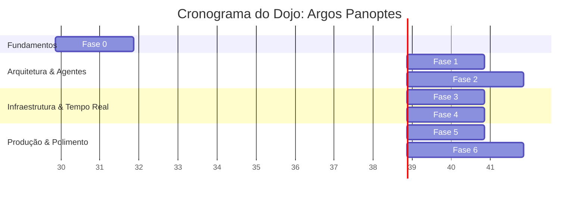

# Roadmap de Desenvolvimento — Argos Panoptes

## Objetivo do Dojo
Este dojo é um projeto de estudo intensivo estruturado com um propósito claro: elevar o desenvolvedor ao nível **Senior/Staff** nas seguintes disciplinas chave:

- **Python Avançado:** Domínio de concorrência com `async/await`, `type hints` avançados, `metaclasses`, `descriptors` e `protocols`.
- **LangGraph:** Proficiência em `StateGraph`, `subgraphs`, `Command`, `checkpointing` e `streaming` de eventos.
- **Arquitetura de Sistemas Agênticos:** Design de sistemas multi-agente, padrões de supervisor e arquiteturas hierárquicas escaláveis.
- **Engenharia de Contexto:** Técnicas avançadas de `context engineering` e `prompt engineering` para extração de estruturação de dados.
- **Engenharia de Software de Produção:** Testes automatizados, observabilidade avançada, CI/CD e práticas robustas de deployment.

---

## Cronograma (Visão Geral)

---

## Trilha de Aprendizado

### Fase 0: Fundamentos (Semana 1-2)
- **O que será aprendido:**
  - Python avançado: `async/await`, typing dinâmico e estático, Pydantic v2, protocols para injeção de dependência.
  - LangGraph básico: Construção de `StateGraph`, definição de `nodes`, `edges` e roteamento com `conditional edges`.
  - FastAPI: Fundamentos de WebSockets e injeção de dependência (`Depends`).
- **O que será implementado:**
  - Um projeto "Hello World" multi-agente contendo 2 nós simples que se comunicam.
- **Critérios de domínio:**
  - Conseguir tipar estruturas complexas sem usar `Any`.
  - Compreender o ciclo de vida do event loop no `asyncio`.
  - Criar um grafo no LangGraph de cabeça, sem consultar a documentação básica.
- **Recursos de estudo recomendados:**
  - Documentação oficial do LangGraph e FastAPI.
  - [Documentação do Python `asyncio`](https://docs.python.org/3/library/asyncio.html).

### Fase 1: Arquitetura Core (Semana 3-4)
- **O que será aprendido:**
  - Padrões avançados de roteamento de intenção (Intent Classification).
  - Implementação do padrão Supervisor em sistemas multi-agente.
  - Gerenciamento de estado com `TypedDict` e Pydantic no contexto do grafo.
- **O que será implementado:**
  - Nó de Classificação de Intenções retornando dados estruturados (Structured Output).
  - Um Supervisor funcional roteando requisições.
  - O primeiro subgrafo aprofundado (`HostingAgent`).
  - Persistência de memória usando PostgreSQL (`checkpointing`).
- **Critérios de domínio:**
  - O Supervisor consegue rotear corretamente 95% das queries de teste para o agente adequado.
  - O histórico da conversa persiste e pode ser recuperado entre sessões.
- **Recursos de estudo recomendados:**
  - Tutoriais multi-agente do LangGraph.
  - [Guia de Padrões de Agentes da Anthropic](https://www.anthropic.com/research).

### Fase 2: Deep Agents (Semana 5-7)
- **O que será aprendido:**
  - Especialização de subgrafos e modularidade arquitetural.
  - Integração de ferramentas externas e APIs.
  - Estratégias de colaboração entre agentes (Synthesizer node).
  - Padrões de resiliência: Error handling e retries lógicos.
- **O que será implementado:**
  - Múltiplos subgrafos especializados: VPS, Dedicado, Email e DNS.
  - Integração com ferramentas reais (wrappers para cPanel/WHM API).
  - Nó sintetizador para agrupar respostas de múltiplos subagentes.
- **Critérios de domínio:**
  - Agentes conseguem resolver um problema complexo que exige a consulta em duas APIs distintas (ex: DNS e cPanel) de forma autônoma e lidando com falhas (retentativas).
- **Recursos de estudo recomendados:**
  - Documentação da API do cPanel/WHM.
  - Biblioteca `tenacity` para retries em Python.
  - Exemplos de subgrafos no repositório do LangGraph.

### Fase 3: WebSocket & Real-Time (Semana 8-9)
- **O que será aprendido:**
  - Comunicação bidirecional em tempo real.
  - Streaming de respostas de LLMs assincronamente.
  - Gerenciamento de múltiplas conexões concorrentes.
- **O que será implementado:**
  - Integração completa de WebSockets com FastAPI.
  - Streaming de tokens usando `astream_events` do LangGraph.
  - Lógica de conexão, desconexão e reconexão (connection manager).
  - Um cliente frontend mock (HTML/JS) para testes manuais.
- **Critérios de domínio:**
  - Conseguir enviar uma mensagem e ver a resposta do agente renderizando token a token no frontend de teste.
  - Gerenciamento robusto sem vazamento de memória nas conexões (memory leaks).
- **Recursos de estudo recomendados:**
  - Documentação de WebSockets no FastAPI.
  - Artigos sobre trade-offs entre SSE (Server-Sent Events) vs WebSockets.

### Fase 4: Background Tasks & Rotinas (Semana 10-11)
- **O que será aprendido:**
  - Execução assíncrona desacoplada do request/response.
  - Agendamento de tarefas e rotinas de manutenção.
- **O que será implementado:**
  - Sistema de background tasks para verificações assíncronas.
  - Rotinas de monitoramento de saúde de servidores (Health monitoring).
  - Verificações ativas de renovação de certificados SSL.
  - Sistema de alertas de uso (recursos no limite).
  - Geração de relatórios periódicos (Scheduled reports).
- **Critérios de domínio:**
  - Tarefas de background não bloqueiam o event loop principal.
  - Se uma tarefa de background falhar, o sistema continua rodando (isolamento de falhas).
- **Recursos de estudo recomendados:**
  - `asyncio.TaskGroup` no Python 3.11+.
  - Biblioteca `APScheduler` ou `Celery` (se houver necessidade de queue distribuída).
  - LangGraph `CronClient`.

### Fase 5: Observabilidade & Produção (Semana 12-13)
- **O que será aprendido:**
  - Monitoramento, logging estruturado e tracing de requisições.
  - Containerização e pipelines de CI/CD.
- **O que será implementado:**
  - Integração com LangSmith para tracing completo das chamadas aos LLMs e transições do grafo.
  - Logging estruturado usando a biblioteca `structlog`.
  - Exportação de métricas básicas (dashboards simulados).
  - Containerização do projeto (Docker).
  - Pipeline de CI/CD básico com GitHub Actions.
- **Critérios de domínio:**
  - Encontrar o gargalo de performance de um request consultando o trace do LangSmith.
  - Aplicação "dockerizada" roda com um único comando `docker-compose up`.
- **Recursos de estudo recomendados:**
  - Documentação oficial do LangSmith.
  - Best practices de Docker (multi-stage builds, rootless containers).
  - Documentação do `pytest-asyncio`.

### Fase 6: Polimento & Extensão (Semana 14-16)
- **O que será aprendido:**
  - Human-in-the-loop (HITL) em fluxos de trabalho autônomos.
  - Segurança, otimização e integrações de negócio de alto nível.
- **O que será implementado:**
  - Ponto de interrupção (Human-in-the-loop) para aprovação de operações críticas (ex: reiniciar um servidor VPS).
  - Rate limiting e hardening de segurança nos endpoints WebSocket/HTTP.
  - Otimização de performance de gravação de memória/estado.
  - Integração com Construtor de Sites (Extendify).
  - Agente de faturamento interligado (integração com WHMCS).
  - Suíte compreensiva de testes.
  - Documentação final do projeto.
- **Critérios de domínio:**
  - O sistema pausa a execução, aguarda a aprovação externa via webhook/API e retoma o estado perfeitamente para concluir a ação.
  - Cobertura de testes demonstrando estabilidade do núcleo (core).

---

## Marcos de Competência

| Área | Junior (Iniciante) | Pleno (Intermediário) | Senior (Avançado) | Staff (Especialista) |
| :--- | :--- | :--- | :--- | :--- |
| **Python** | Conhece a sintaxe, cria funções básicas e scripts lineares. | Usa list comprehensions, entende escopos, cria classes básicas. | Domina `asyncio`, cria arquiteturas com decorators, usa typing intensivo e metaclasses. | Desenha arquiteturas baseadas em `protocols`, otimiza o uso do GIL, gerencia memory leaks e concorrência massiva. |
| **Sistemas Agênticos (LangGraph)** | Entende o que é um prompt, cria correntes simples (chains). | Cria agentes reativos, usa ferramentas (tools) simples e gerencia histórico. | Desenha grafos complexos (StateGraph), gerencia estados não-triviais, implementa roteadores condicionais robustos. | Arquitetura sistemas hierárquicos multi-agente, cria fluxos de colaboração e sintetizadores, compreende trade-offs de checkpointing distribuído. |
| **APIs e Redes** | Cria endpoints GET/POST básicos em Flask/FastAPI. | Implementa CRUD completo, middlewares básicos e entende status HTTP. | Domina WebSockets, streaming assíncrono, lida com backpressure e desenha APIs resilientes. | Arquitetura sistemas em tempo real escaláveis, desenha protocolos sobre WebSockets, implementa rate-limiting eficiente. |
| **Engenharia de Software** | Escreve código que "funciona". | Escreve testes unitários básicos, entende CI/CD superficialmente. | Desenha para testabilidade (TDD), implementa CI/CD completo, foca em observabilidade e logging estruturado. | Define os padrões técnicos da equipe, lidera refatorações críticas, garante escalabilidade e resiliência sistêmica. |

---

## Métricas de Sucesso do Dojo
Ao final das 16 semanas, o projeto **Argos Panoptes** deve demonstrar os seguintes resultados concretos para provar o sucesso da jornada:

1. **Ampla Cobertura:** O sistema atende pelo menos **8 domínios de suporte diferentes** (VPS, Dedicado, DNS, Email, Faturamento, SSL, etc).
2. **Modularidade Rigorosa:** Todos os agentes especializados funcionam como **subgraphs independentes**, plugáveis à arquitetura central.
3. **Performance em Tempo Real:** O WebSocket streaming está funcional, entregando o primeiro token (`Time to First Token - TTFT`) com latência **menor que 500ms**.
4. **Resiliência Assíncrona:** As *background tasks* executam de forma confiável e isolada, sem afetar o serviço principal de chat em tempo real.
5. **Garantia de Qualidade:** Cobertura de testes **superior a 80%** para as lógicas de roteamento e ferramentas críticas.
6. **Visibilidade Sistêmica:** Observabilidade completa estabelecida, com rastreios (traces) complexos legíveis no **LangSmith**.
7. **Domínio Técnico Analítico:** O desenvolvedor é capaz de apresentar a arquitetura e defender verbalmente (ou por escrito) cada trade-off técnico adotado.

> [!NOTE] 
> O sucesso neste Dojo não significa apenas concluir as tarefas, mas sim **absorver o raciocínio arquitetural**. Cada decisão (por que usar Redis vs Postgres para estado? Por que Supervisor vs Rede P2P de agentes?) deve ser documentada e compreendida profundamente.
